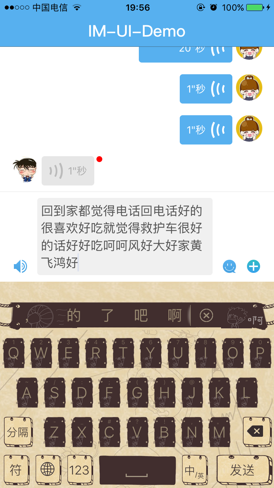
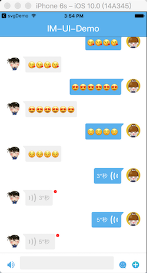

# react-native-imUI
基于React Native 实现的IM聊天功能，这部分代码是项目中抽出来的 IM界面UI部分代码

####一.依赖组件
###### [react-native-invertible-scroll-view](https://github.com/exponentjs/react-native-invertible-scroll-view)
###### [react-native-svg](https://github.com/react-native-community/react-native-svg)


####二.安装配置

#####1.第一步
```
npm install
```
#####2.第二步

为了输入框的效果 TextInput iOS源码又部分更改 
请将根目录下 
```
RCTTextView.h/RCTTextView.m/RCTTextViewManager.m
```
文件替换下面目录中对应文件
```
node_modules/react-native/Libraries/Text
```
或者将根目录文件中／＊－－－－－－－－－－－－＊／包起的代码部分手动合并到上面下对应文件中

####四.运行效果
#####整体效果
 
 
 
 
 


